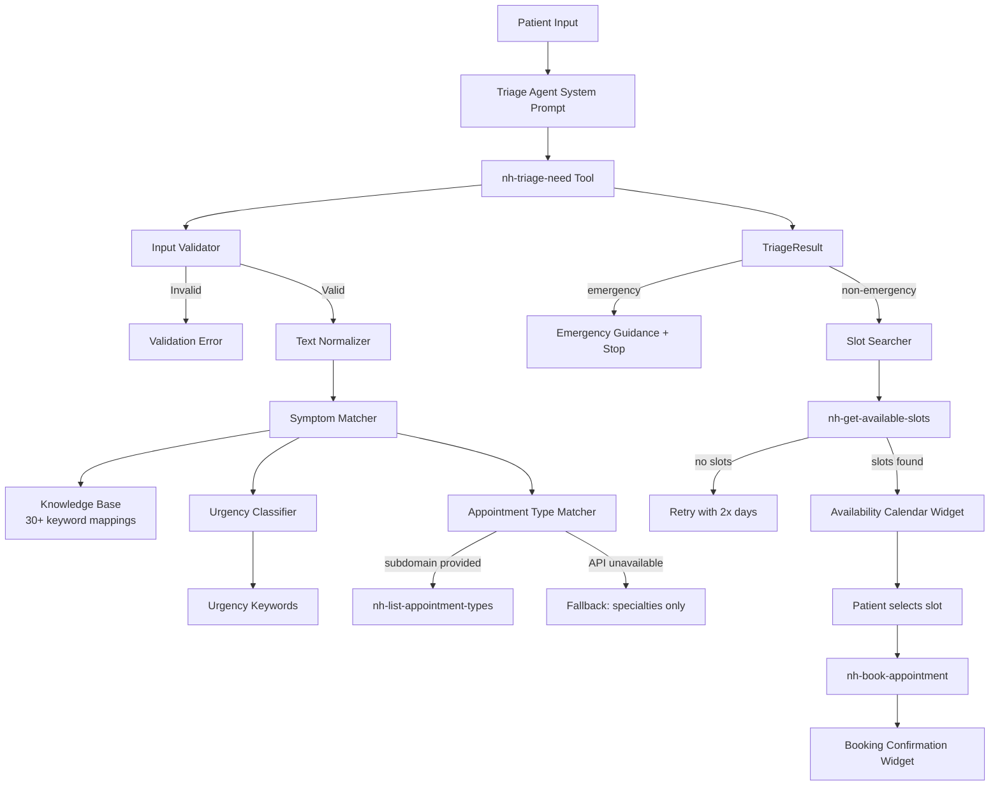

# Design: Medical Triage Agent

## Overview

The Medical Triage Agent adds a medical reasoning layer between natural language patient input and the existing NexHealth MCP tools. It introduces a new `nh-triage-need` MCP tool (Symptom_Mapper) that maps symptom descriptions to specialties and appointment types, an urgency classifier that determines booking timeframes, and an agent system prompt that orchestrates the full triage-to-booking flow.

The system operates as a pipeline:

```
Patient symptom text
  → nh-triage-need (Symptom_Mapper + Urgency_Classifier)
  → TriageResult { specialties, appointment_types, urgency }
  → Urgency-aware slot search (Slot_Searcher)
  → Provider availability calendar
  → nh-book-appointment
  → Booking confirmation
```

All triage logic is pure TypeScript — no external ML models or APIs beyond NexHealth. The symptom-to-specialty mapping uses a built-in keyword knowledge base with fuzzy matching, and urgency classification uses keyword-based rules.

## Architecture



The architecture follows a layered approach:

1. **Triage Layer** (`src/triage/`) — Pure functions for symptom matching, urgency classification, and result construction. No side effects, fully testable.
2. **Tool Layer** (`index.ts`) — MCP tool registration for `nh-triage-need`, wiring triage logic to the MCP server and NexHealth client.
3. **Orchestration Layer** (Agent system prompt) — LLM-driven flow control that calls tools in sequence and handles branching (emergency vs. non-emergency).

### Design Decisions

- **Keyword-based matching over ML**: A static keyword map is deterministic, testable, and requires no model inference. It covers the 80% case for common symptoms. The LLM in the agent layer handles ambiguity and edge cases.
- **Urgency classification co-located with symptom mapping**: Both operate on the same normalized input text, so they share a single tool invocation rather than requiring two separate calls.
- **Fallback-first resilience**: When NexHealth API is unavailable, the tool still returns specialty recommendations from the built-in map. This ensures the triage step never fully fails.

## Components and Interfaces

### 1. Symptom Knowledge Base (`src/triage/knowledge-base.ts`)

A static map of symptom keywords/phrases to specialty recommendations with base confidence scores.

```typescript
export interface SymptomMapping {
  keywords: string[];
  specialty: string;
  baseConfidence: number;
}

export const SYMPTOM_KNOWLEDGE_BASE: SymptomMapping[] = [
  { keywords: ["tooth", "teeth", "dental", "cavity", "gum", "molar"], specialty: "dentistry", baseConfidence: 0.9 },
  { keywords: ["skin", "rash", "acne", "eczema", "mole", "dermatitis"], specialty: "dermatology", baseConfidence: 0.85 },
  { keywords: ["bone", "fracture", "joint", "sprain", "wrist", "knee", "shoulder", "back pain", "spine"], specialty: "orthopedics", baseConfidence: 0.85 },
  { keywords: ["eye", "vision", "blurry", "glasses", "contacts"], specialty: "ophthalmology", baseConfidence: 0.85 },
  { keywords: ["ear", "hearing", "throat", "sinus", "tonsil", "nose"], specialty: "ent", baseConfidence: 0.85 },
  { keywords: ["heart", "chest pain", "palpitation", "blood pressure"], specialty: "cardiology", baseConfidence: 0.9 },
  { keywords: ["anxiety", "depression", "mental health", "stress", "insomnia", "panic"], specialty: "psychiatry", baseConfidence: 0.85 },
  { keywords: ["child", "pediatric", "infant", "toddler", "baby"], specialty: "pediatrics", baseConfidence: 0.8 },
  { keywords: ["pregnant", "pregnancy", "prenatal", "gynecolog", "period", "menstrual"], specialty: "obstetrics-gynecology", baseConfidence: 0.85 },
  { keywords: ["stomach", "digest", "nausea", "vomit", "diarrhea", "constipat", "abdominal"], specialty: "gastroenterology", baseConfidence: 0.85 },
  { keywords: ["headache", "migraine", "seizure", "numbness", "tingling", "nerve"], specialty: "neurology", baseConfidence: 0.85 },
  { keywords: ["allergy", "allergic", "hives", "sneez", "hay fever"], specialty: "allergy-immunology", baseConfidence: 0.8 },
  { keywords: ["diabetes", "thyroid", "hormone", "endocrine"], specialty: "endocrinology", baseConfidence: 0.85 },
  { keywords: ["kidney", "urinary", "bladder", "urine"], specialty: "urology", baseConfidence: 0.85 },
  { keywords: ["lung", "breathing", "cough", "asthma", "wheez", "pneumonia"], specialty: "pulmonology", baseConfidence: 0.85 },
  // ... additional mappings to reach 30+
];
```

### 2. Urgency Keywords (`src/triage/urgency.ts`)

```typescript
export type UrgencyLevel = "emergency" | "urgent" | "soon" | "routine";

export const EMERGENCY_KEYWORDS: string[] = [
  "chest pain", "difficulty breathing", "can't breathe", "uncontrolled bleeding",
  "severe trauma", "unconscious", "stroke", "heart attack", "seizure now",
  "choking", "anaphylaxis", "overdose", "suicidal",
];

export const URGENT_KEYWORDS: string[] = [
  "acute pain", "high fever", "severe pain", "recent injury", "broken",
  "deep cut", "infection", "swelling", "can't walk", "vomiting blood",
];

export function classifyUrgency(normalizedText: string): UrgencyLevel;
```

### 3. Text Normalizer (`src/triage/normalizer.ts`)

```typescript
/** Lowercase, trim, strip extraneous punctuation */
export function normalizeInput(raw: string): string;
```

### 4. Symptom Matcher (`src/triage/matcher.ts`)

```typescript
import type { SpecialtyRecommendation } from "./types.js";

/**
 * Match normalized text against the knowledge base.
 * Returns 1–5 specialties ranked by confidence (descending).
 * Falls back to "general practice" at confidence < 0.5 if no keywords match.
 */
export function matchSymptoms(normalizedText: string): SpecialtyRecommendation[];
```

### 5. Appointment Type Matcher (`src/triage/appointment-matcher.ts`)

```typescript
import type { NexHealthAppointmentType } from "../nexhealth/types.js";

/**
 * Given specialty recommendations and NexHealth appointment types,
 * return matching appointment type IDs.
 * Returns empty array if no match or types unavailable.
 */
export function matchAppointmentTypes(
  specialties: string[],
  appointmentTypes: NexHealthAppointmentType[],
): { id: number; name: string }[];
```

### 6. Triage Orchestrator (`src/triage/triage.ts`)

```typescript
import type { TriageResult } from "./types.js";

/**
 * Full triage pipeline: normalize → match symptoms → classify urgency → match appointment types.
 * Pure function when appointmentTypes are provided; calls NexHealth when subdomain is given.
 */
export function triage(description: string, appointmentTypes?: NexHealthAppointmentType[]): TriageResult;
```

### 7. MCP Tool Registration (addition to `index.ts`)

```typescript
import { triageNeedSchema } from "./src/triage/schemas.js";

server.tool(
  {
    name: "nh-triage-need",
    description: "Analyze patient symptoms and return specialty recommendations, appointment types, and urgency classification. Call this first when a patient describes symptoms.",
    schema: triageNeedSchema,
  },
  async (params) => { /* ... */ }
);
```

### 8. Slot Searcher Logic

The slot search orchestration lives in the agent system prompt instructions rather than as a separate module. The agent is instructed to:
1. Read `urgency` from the `TriageResult`
2. Map urgency to days: `urgent=1`, `soon=7`, `routine=14`
3. Call `nh-get-available-slots` with `start_date=today`, `days=<mapped value>`
4. If zero slots returned, retry with `days * 2`
5. If still zero, inform patient to contact practice directly

This keeps the slot search logic in the LLM orchestration layer where it belongs — it's a multi-step decision flow, not a pure function.

## Data Models

### TriageResult (`src/triage/types.ts`)

```typescript
export type UrgencyLevel = "emergency" | "urgent" | "soon" | "routine";

export interface SpecialtyRecommendation {
  name: string;
  confidence: number; // 0–1 inclusive
}

export interface AppointmentTypeMatch {
  id: number;
  name: string;
}

export interface TriageResult {
  specialties: SpecialtyRecommendation[]; // 1–5 elements, sorted by confidence desc
  appointment_types: AppointmentTypeMatch[]; // empty if unavailable
  urgency: UrgencyLevel;
  warnings?: string[]; // e.g., "Live appointment type matching unavailable"
}

export interface TriageError {
  code: "VALIDATION_ERROR" | "API_ERROR" | "UNKNOWN_ERROR";
  message: string;
}
```

### Triage Input Schema (`src/triage/schemas.ts`)

```typescript
import { z } from "zod";

export const triageNeedSchema = z.object({
  description: z.string().min(3, "Symptom description must be at least 3 characters"),
  subdomain: z.string().optional().describe("Institution subdomain for live appointment type matching"),
}).strict();
```

### Urgency-to-Days Mapping

| Urgency Level | Days Parameter | Retry Days |
|---------------|---------------|------------|
| emergency     | N/A (no booking) | N/A |
| urgent        | 1             | 2          |
| soon          | 7             | 14         |
| routine       | 14            | 28*        |

*Capped at 14 by NexHealth API max; retry may need multiple calls or inform patient.


## Correctness Properties

*A property is a characteristic or behavior that should hold true across all valid executions of a system — essentially, a formal statement about what the system should do. Properties serve as the bridge between human-readable specifications and machine-verifiable correctness guarantees.*

### Property 1: TriageResult structural invariant

*For any* valid symptom description (≥ 3 characters), the `triage()` function SHALL return a `TriageResult` where `specialties` has length between 1 and 5 inclusive, every `confidence` value is in [0, 1], and `urgency` is one of {emergency, urgent, soon, routine}.

**Validates: Requirements 1.1, 7.1, 7.3, 7.4**

### Property 2: Appointment type IDs are a subset of available types

*For any* list of `NexHealthAppointmentType` objects and any list of specialty names, all `id` values in the array returned by `matchAppointmentTypes()` SHALL exist in the input appointment types array.

**Validates: Requirements 1.2**

### Property 3: Invalid input produces validation error

*For any* string with fewer than 3 characters (including empty strings), the `nh-triage-need` tool SHALL return a validation error and SHALL NOT invoke any downstream triage or NexHealth logic.

**Validates: Requirements 1.3, 8.1**

### Property 4: Confidence scores in descending order

*For any* symptom description, the `specialties` array in the returned `TriageResult` SHALL have confidence scores in non-increasing order (each score ≥ the next).

**Validates: Requirements 2.3**

### Property 5: Normalization invariance

*For any* symptom description string, `matchSymptoms(input)` SHALL produce the same specialty results as `matchSymptoms(input.toUpperCase())` and `matchSymptoms("  " + input + "  ")` — casing and surrounding whitespace do not affect output.

**Validates: Requirements 2.4**

### Property 6: Urgency classifier returns exactly one valid level

*For any* non-empty string, `classifyUrgency()` SHALL return exactly one value from the set {emergency, urgent, soon, routine}.

**Validates: Requirements 3.1**

### Property 7: Urgency-to-days mapping

*For any* non-emergency `UrgencyLevel`, the slot search days parameter SHALL equal the defined mapping: urgent→1, soon→7, routine→14. The `start_date` SHALL equal today's date in YYYY-MM-DD format.

**Validates: Requirements 3.3, 3.4, 3.5, 5.1**

### Property 8: Emergency keywords always produce emergency classification

*For any* string containing at least one emergency keyword (chest pain, difficulty breathing, uncontrolled bleeding, severe trauma), `classifyUrgency()` SHALL return "emergency".

**Validates: Requirements 3.6**

### Property 9: Urgent keywords produce urgent classification

*For any* string containing at least one urgent keyword (acute pain, high fever, recent injury) and no emergency keywords, `classifyUrgency()` SHALL return "urgent".

**Validates: Requirements 3.7**

### Property 10: Retry doubles the search window

*For any* initial `days` value used in a slot search that returns zero results, the retry search SHALL use a `days` value exactly equal to `2 × original days`.

**Validates: Requirements 5.2**

### Property 11: Unknown symptoms fall back to general practice

*For any* symptom description that matches zero keywords in the built-in knowledge base, `matchSymptoms()` SHALL return at least one result with specialty "general practice" or "primary care" and a confidence score strictly less than 0.5.

**Validates: Requirements 8.4**

### Property 12: Error messages never expose raw API details

*For any* `NexHealthApiError` passed through the error handler, the user-facing output SHALL NOT contain raw HTTP status codes, stack traces, or internal error object fields.

**Validates: Requirements 9.4**

## Error Handling

### Triage Layer Errors

| Error Condition | Behavior | User Message |
|----------------|----------|-------------|
| Input < 3 chars | Return `TriageError` with code `VALIDATION_ERROR` | "Please describe your symptoms in more detail (at least 3 characters)." |
| No keyword matches | Return fallback general practice result | No error — result includes general practice recommendation |
| Knowledge base empty (defensive) | Return general practice fallback | No error visible to user |

### NexHealth API Errors

| Error Condition | Behavior | User Message |
|----------------|----------|-------------|
| API unavailable during appointment type fetch | Return specialties from built-in map, empty `appointment_types`, add warning | "I found specialty recommendations but couldn't check specific appointment types. You may need to confirm the visit type when booking." |
| 401 Authentication error | Stop flow, inform patient | "The scheduling service is temporarily unavailable. Please contact the practice directly." |
| 429 Rate limit | Inform patient to wait | "The system is busy right now. Please wait a moment and try again." |
| 404 Resource not found | Context-specific message | "That [provider/location/patient] wasn't found. The ID may be incorrect." |
| Timeout (AbortError) | Inform patient | "The request timed out. Please try again." |
| Unknown error | Generic safe message | "Something went wrong. Please try again or contact the practice directly." |

### Booking Flow Errors

| Error Condition | Behavior | User Message |
|----------------|----------|-------------|
| Booking API call fails | Show `booking-confirmation` widget with `status: "failed"` | Error message from API (sanitized) + "Try selecting a different time slot." |
| Zero slots on initial search | Retry with doubled days | No error yet — automatic retry |
| Zero slots after retry | Inform patient | "No available appointments were found in the next [X] days. Please contact the practice directly for scheduling assistance." |

### Safety Guardrails

- The agent system prompt explicitly prohibits medical diagnoses, treatment recommendations, and medication suggestions.
- Emergency keyword detection takes priority over all other classifications — if any emergency keyword is present, the flow terminates with emergency guidance regardless of other content.
- Raw API error details (status codes, internal error objects, stack traces) are never exposed to the patient.

## Testing Strategy

### Property-Based Tests (fast-check)

The project will use [fast-check](https://github.com/dubzzz/fast-check) for property-based testing. Each property test runs a minimum of 100 iterations with generated inputs.

Property tests target the pure triage logic in `src/triage/`:

| Property | Module Under Test | Tag |
|----------|------------------|-----|
| Property 1: TriageResult structural invariant | `triage.ts` | Feature: medical-triage-agent, Property 1: TriageResult structural invariant |
| Property 2: Appointment type IDs subset | `appointment-matcher.ts` | Feature: medical-triage-agent, Property 2: Appointment type IDs subset |
| Property 3: Invalid input validation | `schemas.ts` / tool handler | Feature: medical-triage-agent, Property 3: Invalid input validation |
| Property 4: Confidence descending order | `matcher.ts` | Feature: medical-triage-agent, Property 4: Confidence descending order |
| Property 5: Normalization invariance | `matcher.ts` + `normalizer.ts` | Feature: medical-triage-agent, Property 5: Normalization invariance |
| Property 6: Urgency returns valid level | `urgency.ts` | Feature: medical-triage-agent, Property 6: Urgency valid level |
| Property 7: Urgency-to-days mapping | Slot search logic | Feature: medical-triage-agent, Property 7: Urgency-to-days mapping |
| Property 8: Emergency keywords → emergency | `urgency.ts` | Feature: medical-triage-agent, Property 8: Emergency keywords |
| Property 9: Urgent keywords → urgent | `urgency.ts` | Feature: medical-triage-agent, Property 9: Urgent keywords |
| Property 10: Retry doubles days | Slot search logic | Feature: medical-triage-agent, Property 10: Retry doubles days |
| Property 11: Unknown symptoms → general practice | `matcher.ts` | Feature: medical-triage-agent, Property 11: Unknown symptoms fallback |
| Property 12: Error messages safe | Error handler | Feature: medical-triage-agent, Property 12: Error messages safe |

### Unit Tests (example-based)

- API fallback behavior (1.6, 9.1): Mock NexHealth client to throw, verify specialties returned with warning
- Emergency flow termination (3.2, 4.6): Verify emergency triage result stops booking flow
- Specific error codes (9.2, 9.3): Mock 429/401 responses, verify user-friendly messages
- Booking failure widget (6.4): Mock booking failure, verify widget shows `status: "failed"`
- Slot selection passthrough (6.2): Verify `start_time` and `operatory_id` are forwarded correctly

### Smoke Tests

- Knowledge base has ≥ 30 keyword mappings (2.1)
- `nh-triage-need` tool is registered with correct schema (1.4)
- System prompt contains required instructions (4.1, 4.3, 4.4, 4.5, 8.2, 8.3)
- `TriageResult` type exists at `src/triage/types.ts` (7.2)

### Integration Tests

- End-to-end triage-to-booking flow with mocked NexHealth API (6.1, 6.3)
- Subdomain-based appointment type matching with mocked API (1.5)
- Slot search with retry on zero results (5.3)
- Provider specialty filtering (5.4)
