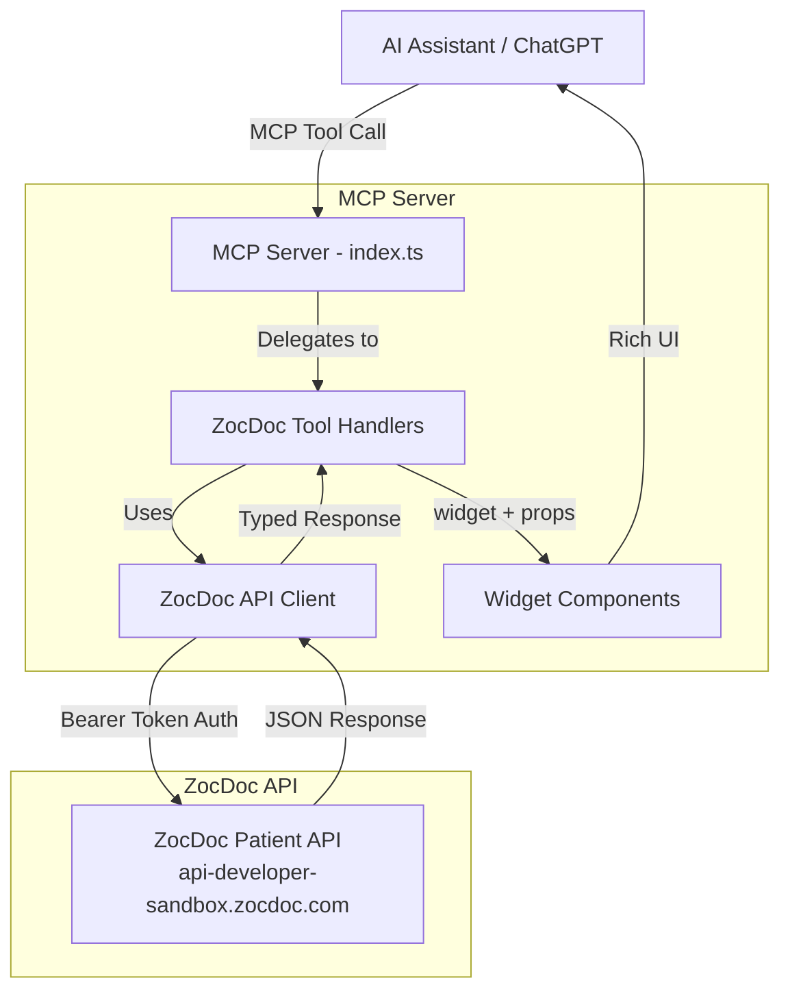
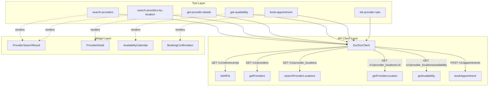
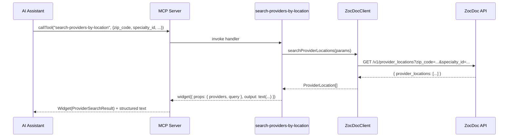
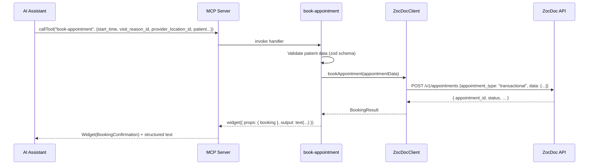

# Design Document: ZocDoc MCP Integration

## Overview

This feature adds a suite of MCP tools to the existing `mcp-use` server that wrap the ZocDoc Patient API, enabling AI assistants (ChatGPT, etc.) to search healthcare providers, check availability, and book appointments on behalf of users. Each tool returns structured data alongside rich widget components for visual display — following the same pattern already established by the `search-tools` and `get-fruit-details` tools in the codebase.

The integration consists of three layers: a ZocDoc API client module handling authentication and HTTP communication, MCP tool definitions exposing the API surface to AI assistants, and React widget components rendering provider cards, availability calendars, and booking confirmations. The API client targets the ZocDoc Developer Sandbox at `https://api-developer-sandbox.zocdoc.com`.

## Architecture





## Sequence Diagrams

### Provider Search Flow



### Appointment Booking Flow



## Components and Interfaces

### Component 1: ZocDocClient (API Client)

**Purpose**: Encapsulates all HTTP communication with the ZocDoc Patient API, handles authentication, request construction, and response parsing.

**Interface**:
```typescript
interface ZocDocClientConfig {
  baseUrl: string;       // https://api-developer-sandbox.zocdoc.com
  apiToken: string;      // Bearer token from env
  timeoutMs?: number;    // Default: 10000
}

class ZocDocClient {
  constructor(config: ZocDocClientConfig);

  listNPIs(params: { page?: number; page_size?: number }): Promise<NPIListResponse>;

  getProviders(params: {
    npis: string[];           // Up to 50 NPIs
    insurance_plan_id?: string;
  }): Promise<ProviderResponse>;

  searchProviderLocations(params: {
    zip_code: string;
    specialty_id?: string;
    visit_reason_id?: string;
    page?: number;
    page_size?: number;
    insurance_plan_id?: string;
    visit_type?: string;
    max_distance_to_patient_mi?: number;
  }): Promise<ProviderLocationSearchResponse>;

  getProviderLocation(params: {
    provider_location_id: string;
    insurance_plan_id?: string;
  }): Promise<ProviderLocationDetail>;

  getAvailability(params: {
    provider_location_ids: string[];
    visit_reason_id: string;
    patient_type: "new" | "existing";
    start_date: string;          // ISO date
    end_date: string;            // ISO date
    published_context?: string;
    insurance_plan_id?: string;
    insurance_carrier_id?: string;
  }): Promise<AvailabilityResponse>;

  bookAppointment(data: BookAppointmentRequest): Promise<BookingResult>;
}
```

**Responsibilities**:
- Construct HTTP requests with proper headers (`Authorization: Bearer <token>`, `Content-Type: application/json`)
- Serialize query parameters for GET requests
- Parse and validate JSON responses
- Map HTTP errors to typed `ZocDocApiError` instances
- Enforce NPI array limit (max 50) on `getProviders`

### Component 2: MCP Tool Definitions

**Purpose**: Register six MCP tools on the server that expose ZocDoc functionality to AI assistants.

**Tools**:

| Tool Name | ZocDoc Endpoint | Widget |
|-----------|----------------|--------|
| `list-provider-npis` | GET /v1/reference/npi | None (text only) |
| `search-providers` | GET /v1/providers | ProviderSearchResult |
| `search-providers-by-location` | GET /v1/provider_locations | ProviderSearchResult |
| `get-provider-details` | GET /v1/provider_locations/{id} | ProviderDetail |
| `get-availability` | GET /v1/provider_locations/availability | AvailabilityCalendar |
| `book-appointment` | POST /v1/appointments | BookingConfirmation |

### Component 3: Widget Components

**Purpose**: React components that render rich UI for each tool's response, following the existing `mcp-use` widget pattern.

**Widgets**:
- `ProviderSearchResult` — Card grid of providers with name, specialty, location, languages
- `ProviderDetail` — Detailed single-provider view with all info, visit reasons, affiliated locations
- `AvailabilityCalendar` — Time slot grid grouped by date, with selectable slots
- `BookingConfirmation` — Confirmation card showing appointment details and status

## Data Models

### ZocDoc API Response Types

```typescript
// --- NPI List ---
interface NPIListResponse {
  npis: string[];
  page: number;
  page_size: number;
  total_count: number;
}

// --- Provider ---
interface Provider {
  npi: string;
  name: string;
  gender_identity?: string;
  spoken_languages: string[];
  specialties: Specialty[];
  visit_reasons: VisitReason[];
  affiliated_locations: AffiliatedLocation[];
}

interface Specialty {
  id: string;
  name: string;
}

interface VisitReason {
  id: string;
  name: string;
  is_new_patient?: boolean;
}

interface AffiliatedLocation {
  id: string;
  name: string;
  address: Address;
  phone_number?: string;
}

interface Address {
  line1: string;
  line2?: string;
  city: string;
  state: string;
  zip_code: string;
}

interface ProviderResponse {
  providers: Provider[];
}

// --- Provider Location Search ---
interface ProviderLocationSummary {
  provider_location_id: string;
  provider_name: string;
  specialty: string;
  address: Address;
  distance_mi?: number;
  next_available_date?: string;
  accepts_insurance?: boolean;
}

interface ProviderLocationSearchResponse {
  provider_locations: ProviderLocationSummary[];
  page: number;
  page_size: number;
  total_count: number;
}

// --- Provider Location Detail ---
interface ProviderLocationDetail {
  provider_location_id: string;
  provider: Provider;
  location: AffiliatedLocation;
  visit_reasons: VisitReason[];
  accepted_insurance_plans?: string[];
}

// --- Availability ---
interface TimeSlot {
  start_time: string;   // ISO datetime
  end_time?: string;
  is_available: boolean;
}

interface ProviderAvailability {
  provider_location_id: string;
  provider_name: string;
  slots: TimeSlot[];
}

interface AvailabilityResponse {
  availabilities: ProviderAvailability[];
}

// --- Booking ---
interface PatientInfo {
  first_name: string;
  last_name: string;
  date_of_birth: string;       // YYYY-MM-DD
  sex_at_birth: "male" | "female";
  phone_number: string;
  email_address: string;
  patient_address: Address;
  insurance?: {
    plan_id: string;
    member_id: string;
  };
  gender?: string;
}

interface BookAppointmentRequest {
  appointment_type: "transactional";
  data: {
    start_time: string;            // ISO datetime
    visit_reason_id: string;
    provider_location_id: string;
    patient: PatientInfo;
    patient_type: "new" | "existing";
    notes?: string;
  };
}

interface BookingResult {
  appointment_id: string;
  status: "confirmed" | "pending" | "failed";
  provider_name: string;
  location: string;
  start_time: string;
  visit_reason: string;
}

// --- Error ---
interface ZocDocApiError {
  status: number;
  code: string;
  message: string;
  details?: Record<string, unknown>;
}
```

**Validation Rules**:
- `npis` array in `getProviders` must contain 1–50 items
- `zip_code` must be a 5-digit US ZIP code
- `start_date` / `end_date` must be valid ISO date strings, `end_date >= start_date`
- `date_of_birth` must be ISO date format (YYYY-MM-DD)
- `phone_number` must be a valid US phone number format
- `email_address` must be a valid email format
- `patient_type` must be either `"new"` or `"existing"`
- `sex_at_birth` must be either `"male"` or `"female"`


### Zod Schemas for MCP Tool Inputs

```typescript
// search-providers tool schema
const searchProvidersSchema = z.object({
  npis: z.array(z.string()).min(1).max(50)
    .describe("NPI numbers to look up (max 50)"),
  insurance_plan_id: z.string().optional()
    .describe("Insurance plan ID to filter by"),
});

// search-providers-by-location tool schema
const searchByLocationSchema = z.object({
  zip_code: z.string().regex(/^\d{5}$/, "Must be a 5-digit ZIP code")
    .describe("US ZIP code to search near"),
  specialty_id: z.string().optional()
    .describe("Specialty ID to filter providers"),
  visit_reason_id: z.string().optional()
    .describe("Visit reason ID"),
  page: z.number().int().min(1).optional()
    .describe("Page number for pagination"),
  page_size: z.number().int().min(1).max(100).optional()
    .describe("Results per page (max 100)"),
  insurance_plan_id: z.string().optional()
    .describe("Insurance plan ID"),
  visit_type: z.string().optional()
    .describe("Type of visit (e.g., in-person, telehealth)"),
  max_distance_to_patient_mi: z.number().positive().optional()
    .describe("Maximum distance in miles from ZIP code"),
});

// get-provider-details tool schema
const getProviderDetailsSchema = z.object({
  provider_location_id: z.string()
    .describe("Provider location ID to fetch details for"),
  insurance_plan_id: z.string().optional()
    .describe("Insurance plan ID"),
});

// get-availability tool schema
const getAvailabilitySchema = z.object({
  provider_location_ids: z.array(z.string()).min(1)
    .describe("Provider location IDs to check availability for"),
  visit_reason_id: z.string()
    .describe("Visit reason ID"),
  patient_type: z.enum(["new", "existing"])
    .describe("Whether the patient is new or existing"),
  start_date: z.string()
    .describe("Start date for availability window (YYYY-MM-DD)"),
  end_date: z.string()
    .describe("End date for availability window (YYYY-MM-DD)"),
  published_context: z.string().optional()
    .describe("Published context identifier"),
  insurance_plan_id: z.string().optional()
    .describe("Insurance plan ID"),
  insurance_carrier_id: z.string().optional()
    .describe("Insurance carrier ID"),
});

// book-appointment tool schema
const bookAppointmentSchema = z.object({
  start_time: z.string()
    .describe("Appointment start time (ISO 8601 datetime)"),
  visit_reason_id: z.string()
    .describe("Visit reason ID"),
  provider_location_id: z.string()
    .describe("Provider location ID"),
  patient_type: z.enum(["new", "existing"])
    .describe("Whether the patient is new or existing"),
  first_name: z.string().describe("Patient first name"),
  last_name: z.string().describe("Patient last name"),
  date_of_birth: z.string()
    .describe("Patient date of birth (YYYY-MM-DD)"),
  sex_at_birth: z.enum(["male", "female"])
    .describe("Patient sex at birth"),
  phone_number: z.string()
    .describe("Patient phone number"),
  email_address: z.string().email()
    .describe("Patient email address"),
  address_line1: z.string().describe("Patient address line 1"),
  address_line2: z.string().optional().describe("Patient address line 2"),
  city: z.string().describe("Patient city"),
  state: z.string().describe("Patient state"),
  zip_code: z.string().regex(/^\d{5}$/).describe("Patient ZIP code"),
  insurance_plan_id: z.string().optional()
    .describe("Insurance plan ID"),
  insurance_member_id: z.string().optional()
    .describe("Insurance member ID"),
  gender: z.string().optional()
    .describe("Patient gender identity"),
  notes: z.string().optional()
    .describe("Additional notes for the appointment"),
});

// list-provider-npis tool schema
const listNPIsSchema = z.object({
  page: z.number().int().min(1).optional()
    .describe("Page number"),
  page_size: z.number().int().min(1).max(100).optional()
    .describe("Results per page"),
});
```

## Key Functions with Formal Specifications

### Function: ZocDocClient.request (private HTTP helper)

```typescript
private async request<T>(method: "GET" | "POST", path: string, params?: Record<string, unknown>): Promise<T>
```

**Preconditions:**
- `this.config.apiToken` is a non-empty string
- `path` starts with `/v1/`
- For GET: `params` are serialized as query string
- For POST: `params` are serialized as JSON body

**Postconditions:**
- Returns parsed JSON of type `T` on 2xx response
- Throws `ZocDocApiError` with status, code, message on non-2xx response
- Request includes `Authorization: Bearer <token>` header
- Request completes within `this.config.timeoutMs` or throws timeout error

### Function: searchProviderLocations

```typescript
async searchProviderLocations(params: {
  zip_code: string;
  specialty_id?: string;
  visit_reason_id?: string;
  page?: number;
  page_size?: number;
  insurance_plan_id?: string;
  visit_type?: string;
  max_distance_to_patient_mi?: number;
}): Promise<ProviderLocationSearchResponse>
```

**Preconditions:**
- `params.zip_code` matches `/^\d{5}$/`
- If provided, `params.page >= 1` and `params.page_size >= 1 && <= 100`
- If provided, `params.max_distance_to_patient_mi > 0`

**Postconditions:**
- Returns `ProviderLocationSearchResponse` with `provider_locations` array
- Each `ProviderLocationSummary` has a valid `provider_location_id`
- `total_count >= provider_locations.length`
- Results are filtered by the provided parameters

### Function: getAvailability

```typescript
async getAvailability(params: {
  provider_location_ids: string[];
  visit_reason_id: string;
  patient_type: "new" | "existing";
  start_date: string;
  end_date: string;
  published_context?: string;
  insurance_plan_id?: string;
  insurance_carrier_id?: string;
}): Promise<AvailabilityResponse>
```

**Preconditions:**
- `params.provider_location_ids` has at least 1 element
- `params.start_date` and `params.end_date` are valid ISO date strings
- `new Date(params.end_date) >= new Date(params.start_date)`
- `params.patient_type` is `"new"` or `"existing"`

**Postconditions:**
- Returns `AvailabilityResponse` with one entry per requested `provider_location_id`
- Each `TimeSlot.start_time` falls within `[start_date, end_date]` range
- Slots are sorted chronologically within each provider

### Function: bookAppointment

```typescript
async bookAppointment(data: BookAppointmentRequest): Promise<BookingResult>
```

**Preconditions:**
- `data.appointment_type === "transactional"`
- `data.data.start_time` is a valid future ISO datetime
- `data.data.patient` contains all required fields with valid formats
- `data.data.provider_location_id` is a valid existing provider location

**Postconditions:**
- Returns `BookingResult` with a non-empty `appointment_id`
- `result.status` is one of `"confirmed"`, `"pending"`, `"failed"`
- If `status === "confirmed"`, the appointment is booked in ZocDoc's system
- If `status === "failed"`, `result` may contain error details

## Algorithmic Pseudocode

### Tool Handler: search-providers-by-location

```typescript
// MCP tool handler for searching providers by location
async function handleSearchByLocation(params: SearchByLocationInput): Promise<WidgetResponse> {
  // 1. Initialize API client
  const client = getZocDocClient();

  // 2. Call ZocDoc API
  const response = await client.searchProviderLocations({
    zip_code: params.zip_code,
    specialty_id: params.specialty_id,
    visit_reason_id: params.visit_reason_id,
    page: params.page,
    page_size: params.page_size,
    insurance_plan_id: params.insurance_plan_id,
    visit_type: params.visit_type,
    max_distance_to_patient_mi: params.max_distance_to_patient_mi,
  });

  // 3. Return widget with provider data
  return widget({
    props: {
      providers: response.provider_locations,
      query: `Providers near ${params.zip_code}`,
      totalCount: response.total_count,
      page: response.page,
      pageSize: response.page_size,
    },
    output: text(
      `Found ${response.total_count} providers near ZIP ${params.zip_code}` +
      (params.specialty_id ? ` for specialty ${params.specialty_id}` : "")
    ),
  });
}
```

### Tool Handler: book-appointment

```typescript
// MCP tool handler for booking an appointment
async function handleBookAppointment(params: BookAppointmentInput): Promise<WidgetResponse> {
  const client = getZocDocClient();

  // 1. Construct patient info from flat params
  const patient: PatientInfo = {
    first_name: params.first_name,
    last_name: params.last_name,
    date_of_birth: params.date_of_birth,
    sex_at_birth: params.sex_at_birth,
    phone_number: params.phone_number,
    email_address: params.email_address,
    patient_address: {
      line1: params.address_line1,
      line2: params.address_line2,
      city: params.city,
      state: params.state,
      zip_code: params.zip_code,
    },
    gender: params.gender,
  };

  // 2. Add insurance if provided
  if (params.insurance_plan_id && params.insurance_member_id) {
    patient.insurance = {
      plan_id: params.insurance_plan_id,
      member_id: params.insurance_member_id,
    };
  }

  // 3. Call ZocDoc booking API
  const result = await client.bookAppointment({
    appointment_type: "transactional",
    data: {
      start_time: params.start_time,
      visit_reason_id: params.visit_reason_id,
      provider_location_id: params.provider_location_id,
      patient,
      patient_type: params.patient_type,
      notes: params.notes,
    },
  });

  // 4. Return booking confirmation widget
  return widget({
    props: { booking: result },
    output: text(
      result.status === "confirmed"
        ? `Appointment confirmed with ${result.provider_name} at ${result.start_time}`
        : `Appointment booking ${result.status}: ${result.appointment_id}`
    ),
  });
}
```

### ZocDocClient: HTTP Request Helper

```typescript
// Core HTTP request method with auth and error handling
private async request<T>(method: "GET" | "POST", path: string, params?: Record<string, unknown>): Promise<T> {
  const url = new URL(path, this.config.baseUrl);

  const options: RequestInit = {
    method,
    headers: {
      "Authorization": `Bearer ${this.config.apiToken}`,
      "Content-Type": "application/json",
      "Accept": "application/json",
    },
    signal: AbortSignal.timeout(this.config.timeoutMs ?? 10_000),
  };

  if (method === "GET" && params) {
    // Serialize params as query string, handling arrays
    for (const [key, value] of Object.entries(params)) {
      if (value !== undefined && value !== null) {
        if (Array.isArray(value)) {
          url.searchParams.set(key, value.join(","));
        } else {
          url.searchParams.set(key, String(value));
        }
      }
    }
  } else if (method === "POST" && params) {
    options.body = JSON.stringify(params);
  }

  const response = await fetch(url.toString(), options);

  if (!response.ok) {
    const errorBody = await response.json().catch(() => ({}));
    throw {
      status: response.status,
      code: errorBody.code ?? "UNKNOWN_ERROR",
      message: errorBody.message ?? response.statusText,
      details: errorBody.details,
    } as ZocDocApiError;
  }

  return response.json() as Promise<T>;
}
```

## Example Usage

```typescript
// --- In index.ts: Registering the search-providers-by-location tool ---
import { MCPServer, text, widget } from "mcp-use/server";
import { z } from "zod";
import { createZocDocClient } from "./src/zocdoc/client";

const zocdoc = createZocDocClient();

server.tool(
  {
    name: "search-providers-by-location",
    description: "Search for healthcare providers near a ZIP code, optionally filtered by specialty and insurance",
    schema: searchByLocationSchema,
    widget: {
      name: "provider-search-result",
      invoking: "Searching for providers...",
      invoked: "Provider results loaded",
    },
  },
  async (params) => {
    const response = await zocdoc.searchProviderLocations(params);
    return widget({
      props: {
        providers: response.provider_locations,
        query: `Providers near ${params.zip_code}`,
        totalCount: response.total_count,
      },
      output: text(`Found ${response.total_count} providers near ${params.zip_code}`),
    });
  }
);

// --- In index.ts: Registering the book-appointment tool ---
server.tool(
  {
    name: "book-appointment",
    description: "Book a healthcare appointment with a provider through ZocDoc",
    schema: bookAppointmentSchema,
    widget: {
      name: "booking-confirmation",
      invoking: "Booking your appointment...",
      invoked: "Appointment booked",
    },
  },
  async (params) => {
    const patient = {
      first_name: params.first_name,
      last_name: params.last_name,
      date_of_birth: params.date_of_birth,
      sex_at_birth: params.sex_at_birth,
      phone_number: params.phone_number,
      email_address: params.email_address,
      patient_address: {
        line1: params.address_line1,
        line2: params.address_line2,
        city: params.city,
        state: params.state,
        zip_code: params.zip_code,
      },
      gender: params.gender,
      insurance: params.insurance_plan_id ? {
        plan_id: params.insurance_plan_id,
        member_id: params.insurance_member_id!,
      } : undefined,
    };

    const result = await zocdoc.bookAppointment({
      appointment_type: "transactional",
      data: {
        start_time: params.start_time,
        visit_reason_id: params.visit_reason_id,
        provider_location_id: params.provider_location_id,
        patient,
        patient_type: params.patient_type,
        notes: params.notes,
      },
    });

    return widget({
      props: { booking: result },
      output: text(
        result.status === "confirmed"
          ? `Appointment confirmed with ${result.provider_name} on ${result.start_time}`
          : `Booking status: ${result.status}`
      ),
    });
  }
);
```

## Correctness Properties

The following properties must hold for all valid inputs:

1. **API Client Auth Invariant**: Every HTTP request sent by `ZocDocClient` includes the `Authorization: Bearer <token>` header with the configured token.

2. **NPI Limit Enforcement**: `getProviders` rejects calls where `npis.length > 50` before making an HTTP request.

3. **Date Range Validity**: `getAvailability` ensures `end_date >= start_date`; all returned `TimeSlot.start_time` values fall within the requested date range.

4. **ZIP Code Format**: All tools accepting `zip_code` validate it matches `/^\d{5}$/` via zod schema before any API call.

5. **Error Propagation**: Any non-2xx response from ZocDoc API is caught and transformed into a `ZocDocApiError` — never silently swallowed.

6. **Widget-Data Consistency**: Widget props always contain the data returned from the API call — no stale or fabricated data is passed to widgets.

7. **Booking Idempotency Awareness**: The `book-appointment` tool returns the `appointment_id` from ZocDoc's response, enabling the AI assistant to detect duplicate bookings.

8. **Pagination Consistency**: For paginated endpoints, `page` and `page_size` in the response match the requested values, and `total_count >= results.length`.

## Error Handling

### Error Scenario 1: Invalid API Token / 401 Unauthorized

**Condition**: `ZOCDOC_API_TOKEN` env var is missing or the token is expired/invalid.
**Response**: `ZocDocClient.request` throws `ZocDocApiError` with `status: 401`. Tool handler catches and returns a text-only error response to the AI assistant: "ZocDoc authentication failed. Please check the API token configuration."
**Recovery**: Server admin must set/refresh the `ZOCDOC_API_TOKEN` environment variable.

### Error Scenario 2: Rate Limiting / 429 Too Many Requests

**Condition**: ZocDoc API returns 429 status.
**Response**: `ZocDocClient.request` throws `ZocDocApiError` with `status: 429`. Tool handler returns text: "ZocDoc API rate limit reached. Please try again in a moment."
**Recovery**: Automatic — subsequent requests after the rate limit window will succeed.

### Error Scenario 3: Invalid Input Parameters

**Condition**: Zod schema validation fails (e.g., invalid ZIP code, missing required fields).
**Response**: `mcp-use` framework automatically returns validation errors to the AI assistant before the handler executes.
**Recovery**: AI assistant corrects the parameters and retries.

### Error Scenario 4: Network Timeout

**Condition**: ZocDoc API does not respond within `timeoutMs`.
**Response**: `AbortSignal.timeout` triggers, `fetch` throws `AbortError`. Tool handler catches and returns: "ZocDoc API request timed out. Please try again."
**Recovery**: Automatic retry by the AI assistant.

### Error Scenario 5: Provider Not Found / 404

**Condition**: `get-provider-details` called with invalid `provider_location_id`.
**Response**: `ZocDocApiError` with `status: 404`. Tool returns: "Provider not found. The provider location ID may be invalid."
**Recovery**: AI assistant should search for providers again to get valid IDs.

### Error Scenario 6: Booking Failure

**Condition**: `POST /v1/appointments` returns an error (slot taken, invalid patient data, etc.).
**Response**: Tool catches the error and returns a `BookingConfirmation` widget with `status: "failed"` and the error message, so the user sees what went wrong.
**Recovery**: AI assistant can suggest checking availability again and retrying with a different slot.

## Testing Strategy

### Unit Testing Approach

- Test `ZocDocClient` methods with mocked `fetch` responses for each endpoint
- Verify correct URL construction, query parameter serialization, and header inclusion
- Test error handling for each HTTP status code (401, 404, 429, 500, timeout)
- Test zod schema validation for each tool's input schema (valid and invalid inputs)
- Test patient data assembly in the booking tool handler

### Property-Based Testing Approach

**Property Test Library**: fast-check

- **ZIP code validation**: For any string, the schema accepts it iff it matches `/^\d{5}$/`
- **NPI array bounds**: For any array of strings, `getProviders` accepts arrays of length 1–50 and rejects others
- **Date range ordering**: For any two dates, `getAvailability` accepts them iff `end_date >= start_date`
- **Query parameter serialization**: For any valid params object, the serialized URL contains all non-undefined values

### Integration Testing Approach

- Test against ZocDoc Developer Sandbox with real HTTP calls (gated behind env flag)
- Verify end-to-end flow: search → get details → check availability → book
- Validate widget rendering with actual API response shapes

## Performance Considerations

- Use `AbortSignal.timeout` on all fetch calls to prevent hanging requests (default 10s)
- The `getProviders` endpoint accepts up to 50 NPIs per call — batch larger sets into multiple calls if needed in the future
- Widget components should use React.memo for provider cards to avoid unnecessary re-renders in large result sets
- Pagination is supported on search endpoints — default to reasonable page sizes (20) to keep response times fast

## Security Considerations

- The `ZOCDOC_API_TOKEN` must be stored as an environment variable, never hardcoded or logged
- Patient PII (name, DOB, phone, email, address) flows through the booking tool — ensure it is only passed to ZocDoc's API and never logged or persisted locally
- All API communication uses HTTPS
- The booking tool should not store or cache patient information after the request completes
- Input validation via zod schemas prevents injection of malformed data into API requests

## Dependencies

- `mcp-use/server` — MCP server framework (existing)
- `zod` — Schema validation (existing)
- `react`, `react-dom` — Widget rendering (existing)
- `tailwindcss` — Widget styling (existing)
- `@openai/apps-sdk-ui` — UI components for widgets (existing)
- Node.js built-in `fetch` — HTTP client (no additional dependency needed)
- Environment variable: `ZOCDOC_API_TOKEN` — Bearer token for ZocDoc API auth

## File Structure

```
├── index.ts                                    # Add ZocDoc tool registrations
├── src/
│   └── zocdoc/
│       ├── client.ts                           # ZocDocClient class
│       ├── types.ts                            # All ZocDoc API types
│       └── schemas.ts                          # Zod schemas for tool inputs
├── resources/
│   ├── provider-search-result/
│   │   ├── widget.tsx                          # ProviderSearchResult widget
│   │   ├── types.ts                            # Widget prop types + zod schema
│   │   └── components/
│   │       └── ProviderCard.tsx                # Individual provider card
│   ├── provider-detail/
│   │   ├── widget.tsx                          # ProviderDetail widget
│   │   ├── types.ts                            # Widget prop types
│   │   └── components/
│   │       ├── LocationInfo.tsx                # Location display
│   │       └── VisitReasonList.tsx             # Visit reasons display
│   ├── availability-calendar/
│   │   ├── widget.tsx                          # AvailabilityCalendar widget
│   │   ├── types.ts                            # Widget prop types
│   │   └── components/
│   │       ├── DateColumn.tsx                  # Single date column
│   │       └── TimeSlotButton.tsx              # Clickable time slot
│   └── booking-confirmation/
│       ├── widget.tsx                          # BookingConfirmation widget
│       └── types.ts                            # Widget prop types
```
